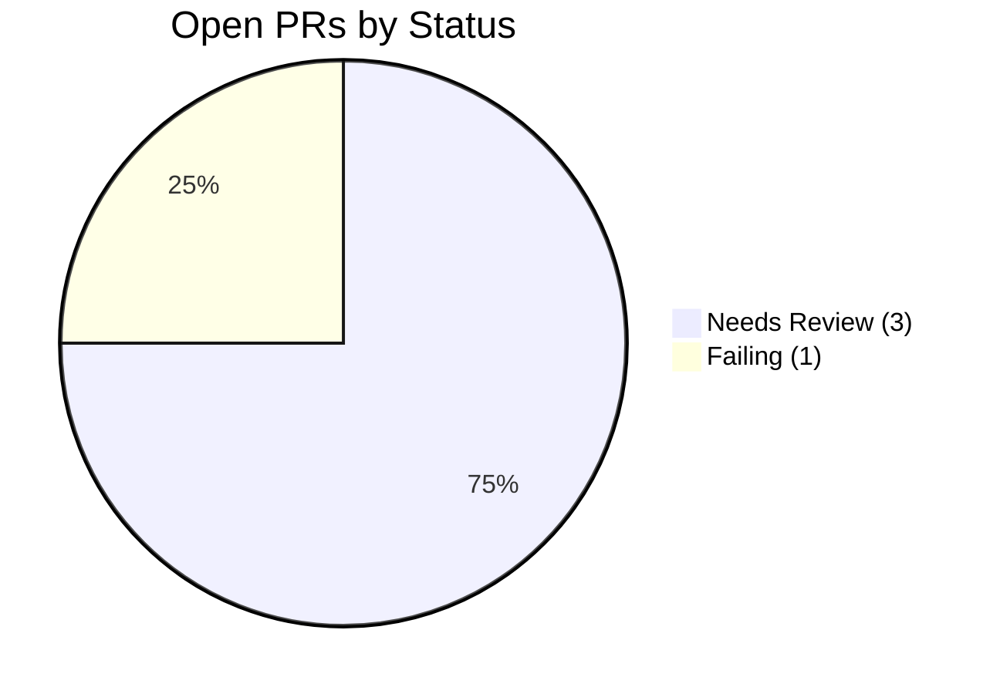
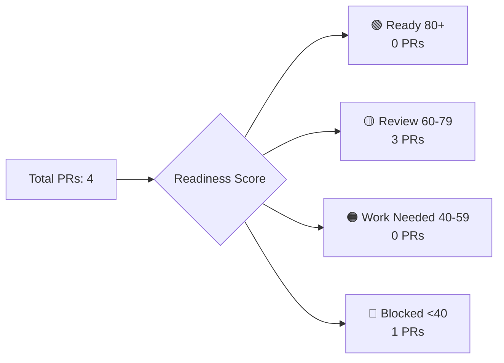

<!-- tracker:summary:start -->
# Issues & PRs Control Board

_Last updated: 10/4/2025, 2:16:29 PM (execution: 2s)_

**At a glance**
- **Repos**: 1 (1 success, 0 failed)
- **Open PRs**: 4 | Ready: 0 | Needs review: 3 | Failing: 1 | Blocked: 0 | Draft: 0 | Stale: 0
- **Open Issues**: 6 | Features: 0 | Bugs: 1 | Stale: 0

**Health Status**: 🟡 4 API failures | Rate limit: 4858 remaining
<!-- tracker:summary:end -->

<!-- tracker:charts:start -->
## 📊 Portfolio Analytics

### PR Status Distribution

### Issue Classification

### Readiness Score Distribution

### SLA Compliance Timeline

```mermaid
gantt
    title SLA Compliance Status
    dateFormat X
    axisFormat %s

    section Critical (P0)
    Overdue PRs     :crit, 0, 1

    section High (P1)
    Due Soon       :active, 0, 1

    section Normal (P2)
    On Track       :done, 0, 1
```

<!-- tracker:charts:end -->

<!-- tracker:ready:start -->
## 🚀 Ready to merge (0)

_No items found_

<!-- tracker:ready:end -->

<!-- tracker:needsreview:start -->
## 👀 Needs review (3)

| PR | Repo | Title | Author | Updated |
|:-:|:---:|:----:|:-----:|:------:|
| [#22](https://github.com/Nitsur10/invoice-dashboard-deploy/pull/22) | invoice-dashboard-deploy | Kanban Board UX Improvements (#11) | Nitsur10 | 10/4/2025 |
| [#14](https://github.com/Nitsur10/invoice-dashboard-deploy/pull/14) | invoice-dashboard-deploy | Move landing page analytics initialization into us... | Nitsur10 | 9/27/2025 |
| [#9](https://github.com/Nitsur10/invoice-dashboard-deploy/pull/9) | invoice-dashboard-deploy | feat: redesign invoice filters as top-right popove... | Nitsur10 | 9/26/2025 |

<!-- tracker:needsreview:end -->

<!-- tracker:failing:start -->
## ❌ Failing checks (1)

| PR | Repo | Title | Details | Updated |
|:-:|:---:|:----:|:------:|:------:|
| [#15](https://github.com/Nitsur10/invoice-dashboard-deploy/pull/15) | invoice-dashboard-deploy | feat: Replace duplicate supplier column with invoi... | Checks failed: 1 failures | 9/27/2025 |

<!-- tracker:failing:end -->

<!-- tracker:blocked:start -->
## 🚫 Blocked PRs (0)

_No items found_

<!-- tracker:blocked:end -->

<!-- tracker:draft:start -->
## 📝 Draft PRs (0)

_No items found_

<!-- tracker:draft:end -->

<!-- tracker:staleprs:start -->
## 🕐 Stale PRs (0)

_No items found_

<!-- tracker:staleprs:end -->

<!-- tracker:features:start -->
## ✨ Feature requests / Enhancements (0)

_No items found_

<!-- tracker:features:end -->

<!-- tracker:bugs:start -->
## 🐛 Bugs (1)

| Issue | Repo | Title | Assignee | Updated |
|:----:|:---:|:----:|:-------:|:------:|
| [#21](https://github.com/Nitsur10/invoice-dashboard-deploy/issues/21) | invoice-dashboard-deploy | 🚨 Portfolio Tracker Update Failed - 2025-10-04 | Unassigned | 10/4/2025 |

<!-- tracker:bugs:end -->

<!-- tracker:staleissues:start -->
## 🕐 Stale issues (0)

_No items found_

<!-- tracker:staleissues:end -->

<!-- tracker:links:start -->
## 🔗 Handy filters

### GitHub Search Links

**Nitsur10/invoice-dashboard-deploy**:
- [Ready to merge](https://github.com/Nitsur10/invoice-dashboard-deploy/pulls?q=is%3Apr+is%3Aopen+review%3Aapproved+status%3Asuccess+-is%3Adraft)
- [Needs review](https://github.com/Nitsur10/invoice-dashboard-deploy/pulls?q=is%3Apr+is%3Aopen+-review%3Aapproved+-is%3Adraft)
- [Failing checks](https://github.com/Nitsur10/invoice-dashboard-deploy/pulls?q=is%3Apr+is%3Aopen+status%3Afailure)
- [All open issues](https://github.com/Nitsur10/invoice-dashboard-deploy/issues?q=is%3Aissue+is%3Aopen)

### Quick Actions
- 📋 [View this tracker](./tracker.md)
- 📊 [View raw data](./tracker.json)
- 🔄 Update tracker: `npm run update:tracker`
<!-- tracker:links:end -->

---
_Generated by Portfolio Control Board v1.0 • Execution time: 2s • API calls: 18 (4 failed)_
