<!-- tracker:summary:start -->
# Issues & PRs Control Board

_Last updated: 11/2/2025, 10:23:08 PM (execution: 1s)_

**At a glance**
- **Repos**: 1 (1 success, 0 failed)
- **Open PRs**: 2 | Ready: 0 | Needs review: 0 | Failing: 1 | Blocked: 0 | Draft: 0 | Stale: 1
- **Open Issues**: 5 | Features: 0 | Bugs: 1 | Stale: 5

**Health Status**: 🟡 2 API failures | Rate limit: 4991 remaining
<!-- tracker:summary:end -->

<!-- tracker:charts:start -->
## 📊 Portfolio Analytics

### PR Status Distribution

### Issue Classification

### Readiness Score Distribution

```mermaid
graph LR
    A[Total PRs: 2] --> B{Readiness Score}
    B --> C[🟢 Ready 80+<br/>0 PRs]
    B --> D[🟡 Review 60-79<br/>1 PRs]
    B --> E[🟠 Work Needed 40-59<br/>0 PRs]
    B --> F[🔴 Blocked <40<br/>1 PRs]
```

### SLA Compliance Timeline

<!-- tracker:charts:end -->

<!-- tracker:ready:start -->
## 🚀 Ready to merge (0)

_No items found_

<!-- tracker:ready:end -->

<!-- tracker:needsreview:start -->
## 👀 Needs review (0)

_No items found_

<!-- tracker:needsreview:end -->

<!-- tracker:failing:start -->
## ❌ Failing checks (1)

| PR | Repo | Title | Details | Updated |
|:-:|:---:|:----:|:------:|:------:|
| [#23](https://github.com/Nitsur10/invoice-dashboard-deploy/pull/23) | invoice-dashboard-deploy | Sync Status Card Filters Across All Pages (ISSUE-1... | Checks failed: 2 failures | 10/9/2025 |

<!-- tracker:failing:end -->

<!-- tracker:blocked:start -->
## 🚫 Blocked PRs (0)

_No items found_

<!-- tracker:blocked:end -->

<!-- tracker:draft:start -->
## 📝 Draft PRs (0)

_No items found_

<!-- tracker:draft:end -->

<!-- tracker:staleprs:start -->
## 🕐 Stale PRs (1)

| PR | Repo | Title | Last Updated |
|:-:|:---:|:----:|:-----------:|
| [#14](https://github.com/Nitsur10/invoice-dashboard-deploy/pull/14) | invoice-dashboard-deploy | Move landing page analytics initialization into useEffect | 9/27/2025 |

<!-- tracker:staleprs:end -->

<!-- tracker:features:start -->
## ✨ Feature requests / Enhancements (0)

_No items found_

<!-- tracker:features:end -->

<!-- tracker:bugs:start -->
## 🐛 Bugs (1)

| Issue | Repo | Title | Assignee | Updated |
|:----:|:---:|:----:|:-------:|:------:|
| [#21](https://github.com/Nitsur10/invoice-dashboard-deploy/issues/21) | invoice-dashboard-deploy | 🚨 Portfolio Tracker Update Failed - 2025-10-04 | Unassigned | 10/4/2025 |

<!-- tracker:bugs:end -->

<!-- tracker:staleissues:start -->
## 🕐 Stale issues (5)

| Issue | Repo | Title | Days Stale |
|:----:|:---:|:----:|:---------:|
| [#25](https://github.com/Nitsur10/invoice-dashboard-deploy/issues/25) | invoice-dashboard-deploy | UI Cleanup & Invoice Status Update Bug Fix | 21 |
| [#21](https://github.com/Nitsur10/invoice-dashboard-deploy/issues/21) | invoice-dashboard-deploy | 🚨 Portfolio Tracker Update Failed - 2025-10-04 | 29 |
| [#5](https://github.com/Nitsur10/invoice-dashboard-deploy/issues/5) | invoice-dashboard-deploy | Implement month-over-month trend metrics pipeline | 40 |
| [#3](https://github.com/Nitsur10/invoice-dashboard-deploy/issues/3) | invoice-dashboard-deploy | Surface stats API failures with user feedback | 40 |
| [#2](https://github.com/Nitsur10/invoice-dashboard-deploy/issues/2) | invoice-dashboard-deploy | Refine invoice status derivation across APIs | 40 |

<!-- tracker:staleissues:end -->

<!-- tracker:links:start -->
## 🔗 Handy filters

### GitHub Search Links

**Nitsur10/invoice-dashboard-deploy**:
- [Ready to merge](https://github.com/Nitsur10/invoice-dashboard-deploy/pulls?q=is%3Apr+is%3Aopen+review%3Aapproved+status%3Asuccess+-is%3Adraft)
- [Needs review](https://github.com/Nitsur10/invoice-dashboard-deploy/pulls?q=is%3Apr+is%3Aopen+-review%3Aapproved+-is%3Adraft)
- [Failing checks](https://github.com/Nitsur10/invoice-dashboard-deploy/pulls?q=is%3Apr+is%3Aopen+status%3Afailure)
- [All open issues](https://github.com/Nitsur10/invoice-dashboard-deploy/issues?q=is%3Aissue+is%3Aopen)

### Quick Actions
- 📋 [View this tracker](./tracker.md)
- 📊 [View raw data](./tracker.json)
- 🔄 Update tracker: `npm run update:tracker`
<!-- tracker:links:end -->

---
_Generated by Portfolio Control Board v1.0 • Execution time: 1s • API calls: 10 (2 failed)_
